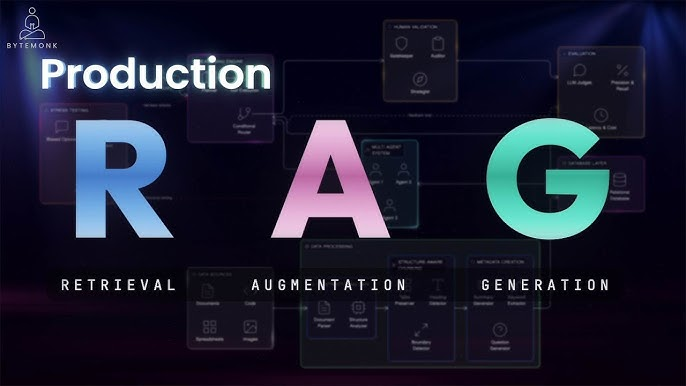
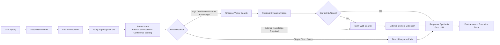
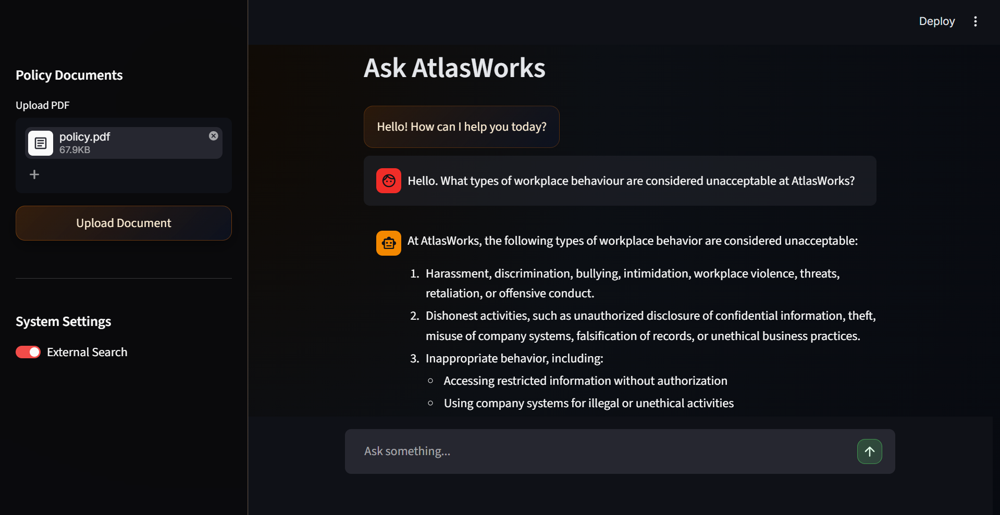
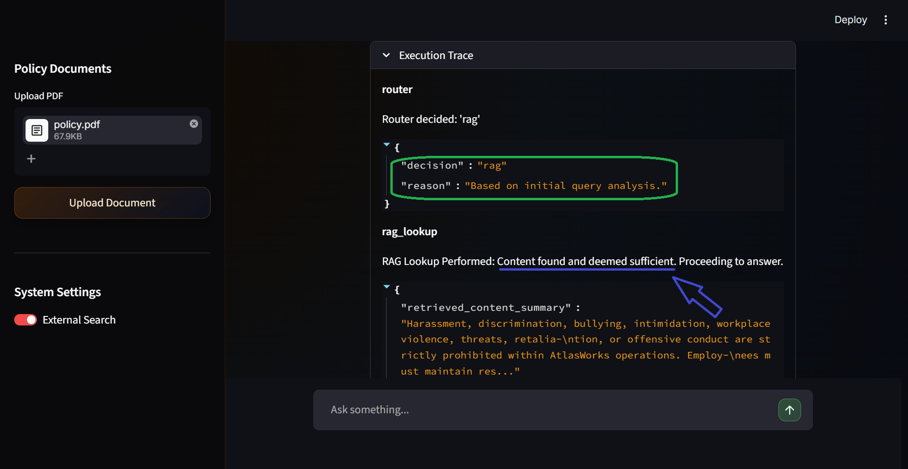
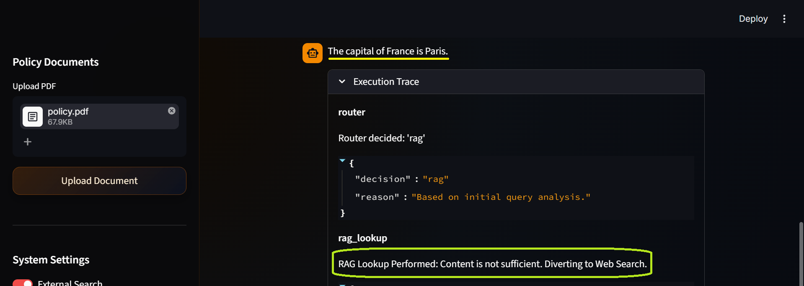
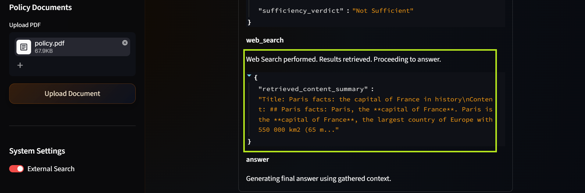
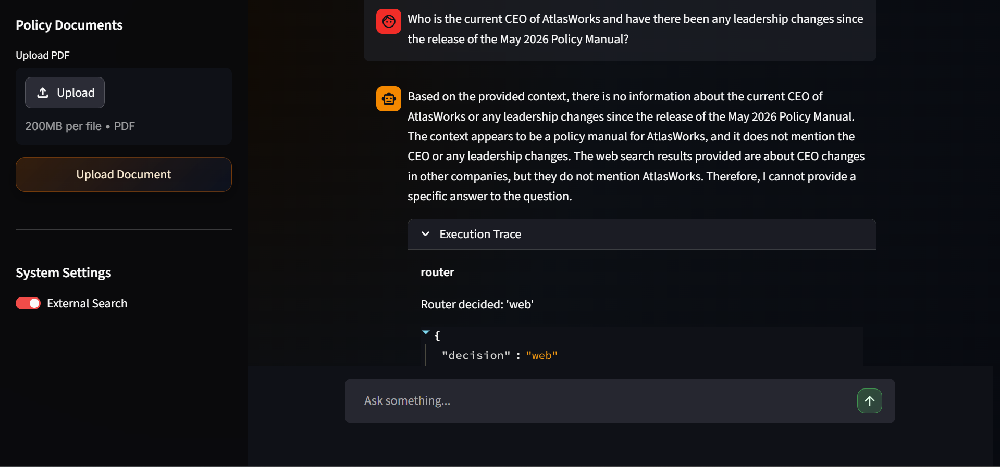

# AtlasWorks AI Policy Intelligence System

Enterprise AI Agent for workplace policy reasoning using Agentic RAG, LangGraph orchestration, and hybrid retrieval systems.

> Built a production-style agentic RAG system using LangGraph, Pinecone, Groq, FastAPI, and Tavily that dynamically routes queries between internal retrieval, reasoning, and web search using confidence-aware orchestration and retrieval validation.



---

## Overview

AtlasWorks AI Policy Intelligence System is a stateful AI orchestration framework designed for enterprise policy reasoning and compliance intelligence.

Instead of relying on a traditional retrieval-augmented generation pipeline, the system implements a conditional agent workflow powered by LangGraph. Each query is dynamically evaluated and routed based on semantic intent, retrieval confidence, contextual sufficiency, and runtime execution constraints.

The architecture combines:
- Retrieval-Augmented Generation (RAG)
- Runtime decision routing
- Retrieval validation
- Dynamic fallback execution
- Structured execution tracing

This enables adaptive, explainable, and enterprise-ready AI behavior while reducing hallucinations and improving response grounding.

---

## Why LangGraph

LangGraph enables deterministic control over LLM behavior by converting the reasoning process into a stateful execution graph.

This replaces:
- uncontrolled prompt chaining

with:

- explicit, inspectable decision nodes and transitions

---

## Core Architecture Principles

The system is designed around four key orchestration concepts:

### 1. Intelligent Query Routing

Queries are dynamically classified into execution paths using an LLM-powered router node.

Depending on query characteristics, the system can:
- Retrieve from internal enterprise knowledge (RAG)
- Route to external web search
- Respond directly without retrieval
- End conversational flows gracefully

This creates adaptive execution behavior rather than static prompt chaining.

---

### 2. Confidence-Gated Retrieval

Unlike standard RAG pipelines:

```text
retrieve → answer
```

AtlasWorks introduces a retrieval evaluation layer:

```text
retrieve → evaluate sufficiency → decide next action
```

Retrieved context is validated before response generation to determine whether the information is sufficiently grounded.

This significantly reduces unsupported or hallucinated outputs.

---

### 3. Dynamic Fallback Execution

If internal retrieval is insufficient:
- The system rejects weak RAG grounding
- Automatically escalates to web search
- Continues execution using external context

This allows the agent to operate safely beyond the boundaries of the internal document corpus.

---

### 4. Stateful Graph Orchestration

The execution workflow is implemented as a LangGraph state machine with:
- Explicit node transitions
- Conditional routing edges
- Shared graph state
- Runtime configuration injection
- Execution checkpointing

This provides deterministic, traceable, and modular orchestration behavior.

---

## Core Capabilities

- **Hybrid AI Routing Engine**  
  Dynamically routes queries between internal RAG, external web search, or direct reasoning based on confidence scoring and semantic intent classification.

- **LangGraph Orchestration Layer**  
  Stateful multi-step execution graph with explicit routing, retrieval, evaluation, and synthesis nodes.

- **Retrieval-Augmented Generation (RAG)**  
  Semantic search over enterprise policy documents using Pinecone vector database.

- **Retrieval Evaluation & Validation Loop**  
  Evaluates whether retrieved context is sufficiently grounded before allowing final response generation.

- **Dynamic Web Fallback System**  
  Automatically redirects insufficient retrieval flows to Tavily web search.

- **Hybrid Knowledge Integration**  
  Combines internal enterprise documents, web search, and Groq-based LLM reasoning.

- **Execution Traceability**  
  Every request produces a structured trace of routing decisions, retrieval paths, and final response generation.

- **Runtime Configuration Injection**  
  Graph behavior can dynamically change during execution using runtime configuration flags.

- **Modular System Design**  
  Clean separation between frontend interface, backend orchestration, and retrieval infrastructure.

---

## High-Level Architecture

### End-to-End System Flow



---

## System Layers

| Layer | Responsibility |
|---|---|
| Frontend Layer | Streamlit-based interface for user interaction and session management |
| API Layer | FastAPI backend handling orchestration and request lifecycle |
| Agent Layer | LangGraph-based reasoning and execution workflow |
| Routing Layer | LLM-powered decision engine for adaptive query routing |
| Retrieval Layer | Pinecone vector database for semantic enterprise document retrieval |
| Validation Layer | Confidence evaluation and retrieval sufficiency checking |
| External Tools Layer | Tavily web search and Groq LLM inference |

---

## Agent Workflow Execution

The system operates as a conditional execution graph where each node contributes to a structured reasoning pipeline.

### Router Node

The router node:
- Interprets semantic query intent
- Evaluates runtime constraints
- Selects the optimal execution path

Possible routes:
- `rag`
- `web`
- `answer`
- `end`

---

### Retrieval Node

The retrieval node:
- Performs semantic similarity search using Pinecone
- Retrieves top-k relevant document chunks
- Passes retrieved context to the evaluation layer

---

### Retrieval Evaluation Node

The evaluation node determines:
- Whether retrieved information sufficiently answers the query
- Whether fallback execution is required
- Whether response generation is safe to proceed

This creates confidence-aware orchestration behavior.

---

### Web Search Node

If retrieval confidence is insufficient:
- Tavily web search is triggered
- External context is collected
- Final synthesis combines all available sources

---

### Response Synthesis Node

The final generation layer:
- Combines validated context
- Synthesizes grounded responses
- Produces execution-aware outputs

---

## Agent Behavior & Query Routing Examples

The following examples demonstrate how AtlasWorks adapts its execution strategy based on confidence evaluation, retrieval quality, and knowledge coverage.

---

### 1. Relevant Query → Successful RAG Flow



Example query:
> “What types of workplace behavior are considered unacceptable at AtlasWorks?”

Execution behavior:
- Query routed to internal RAG pipeline
- Pinecone retrieval returns relevant policy embeddings
- Retrieval evaluation confirms sufficient grounding
- Final response generated using enterprise knowledge

This demonstrates a fully grounded retrieval-augmented execution path.

---

### 2. Internal Reasoning & LangGraph Decision Flow



This illustrates the internal orchestration logic of the LangGraph execution graph.

The system evaluates:
- Retrieval sufficiency
- Confidence thresholds
- Runtime routing constraints
- Fallback eligibility

This transforms the system from a simple chatbot into a structured AI decision workflow.

---

### 3. Irrelevant Query → Web Search Fallback





When a query falls outside internal enterprise knowledge:

Execution behavior:
- Retrieval confidence becomes insufficient
- RAG response generation is rejected
- Query is dynamically rerouted to Tavily web search
- External context is incorporated into synthesis

This ensures adaptive behavior beyond internal document boundaries.

---

### 4. Relevant Query Outside Document Coverage



This scenario demonstrates partial semantic relevance without sufficient grounding.

Although the query relates to enterprise policy:
- The exact information does not exist in indexed documents
- Semantic overlap is detected
- Context validation fails confidence thresholds

System behavior:
- Prevents unsupported assumptions
- Avoids hallucinated responses
- Requests clarification or escalates externally when appropriate

---

## Technical Stack

| Component | Technology |
|---|---|
| Orchestration Framework | LangGraph |
| LLM Inference | Groq |
| Vector Database | Pinecone |
| Embeddings | sentence-transformers/all-MiniLM-L6-v2 |
| Web Search | Tavily |
| Backend API | FastAPI |
| Frontend | Streamlit |
| State Management | LangGraph StateGraph + MemorySaver |

---

## System Summary

AtlasWorks AI demonstrates production-style agentic orchestration through:

- Dynamic query routing
- Confidence-gated retrieval
- Retrieval validation before generation
- Adaptive fallback execution
- Stateful graph orchestration
- Runtime-configurable execution paths
- Grounded response synthesis
- Structured execution traceability

The system is designed not as a simple chatbot, but as a modular AI decision framework capable of safe, explainable, and adaptive enterprise reasoning.

## Core Modules Structure

```
agentBot/
├── frontend/
│   ├── app.py                  # Streamlit entry point
│   ├── ui_components.py       # Chat UI, toggle, trace
│   ├── backend_api.py         # API communication
│   ├── session_manager.py     # Streamlit state management
│   └── config.py              # Frontend config
│
├── backend/
│   ├── main.py                # FastAPI entry point
│   ├── agent.py               # LangGraph AI agent workflow
│   ├── vectorstore.py         # Pinecone RAG logic
│   └── config.py              # API keys and env vars
│
│
├── requirements.txt          # Python dependencies
└── .env                      # API keys (not committed)
```


---

## Technology Stack

- Python 3.9+
- FastAPI
- Streamlit
- LangGraph
- Groq (LLM inference)
- Pinecone (vector database)
- HuggingFace embeddings
- Tavily Search API
- Pydantic

---

## Setup and Installation

### Prerequisites

- Python 3.9+
- API keys for:
  - GROQ_API_KEY
  - PINECONE_API_KEY
  - TAVILY_API_KEY

---

### Installation

```bash
git clone https://github.com/your-username/atlasworks-ai-policy-assistant.git
cd atlasworks-ai-policy-assistant

python -m venv venv
source venv/bin/activate  # Windows: venv\Scripts\activate

pip install -r requirements.txt

```

### Create a .env file

```dotenv
GROQ_API_KEY=your_key
PINECONE_API_KEY=your_key
TAVILY_API_KEY=your_key
```

### Running the application

#### Start Backend
```bash
cd backend
python main.py
```
#### Start Frontend
```bash
cd frontend
streamlit run app.py
```
## Future Improvements

- Integrate core tools such as calculator, calendar, and code execution support
- Enable streaming LLM responses token-by-token for improved real-time experience
- Enhance RAG pipeline with reranking, multi-query retrieval, and better source grounding
- Add long-term memory with user-controlled personalization and session continuity
- Improve UI/UX with themes, smoother animations, and responsive design upgrades
