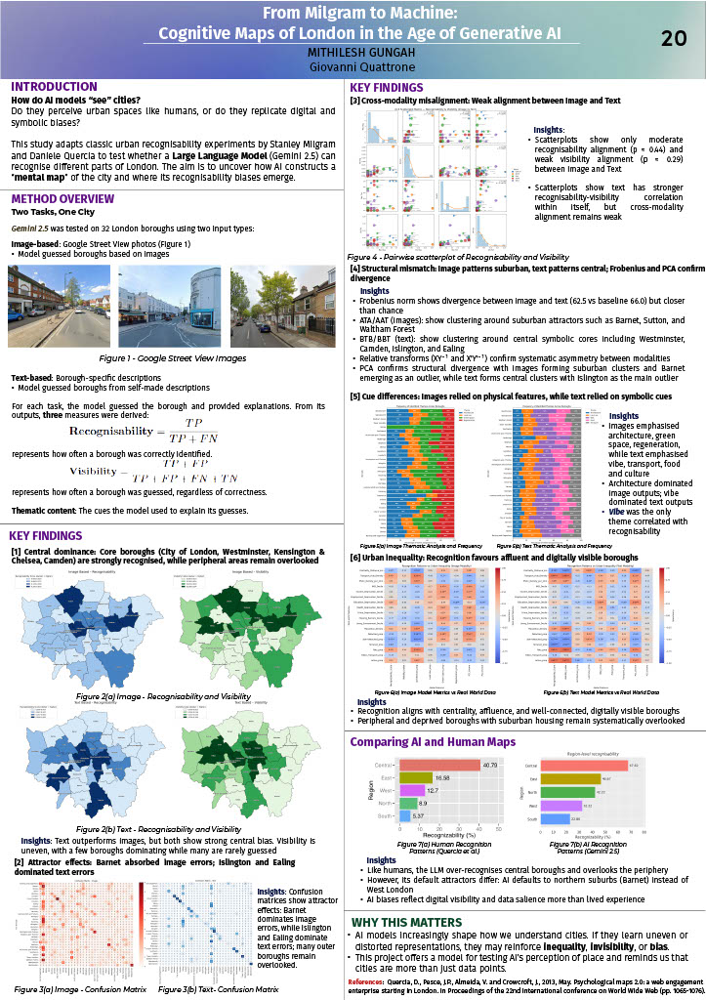

<h1 align="center">Cognitive Maps of London in the Age of Generative AI</h1>
<h3 align="center">Auditing how multimodal LLMs represent urban space through borough recognition, spatial bias, and cognitive map reconstruction</h3>

  

---

## 1. Problem Statement

As Large Language Models increasingly power mapping tools, travel assistants, and location-based services, their internal representations of urban space can shape real-world decisions.

This project investigates whether multimodal LLMs form uneven “cognitive maps” of cities, where central and symbolically prominent areas become over-represented while peripheral districts become less visible.

### Business Context
- Urban AI systems risk reinforcing socio-economic and digital visibility bias
- Boroughs are unevenly represented online, which can skew model familiarity
- Spatial misrepresentation can affect travel recommendations, mapping/search ranking, and smart-city decision support

### Objective
Build a spatial auditing framework that:
- Tests borough recognition using image-based and text-based inference
- Detects central amplification and peripheral suppression patterns
- Reconstructs model cognitive maps via borough-level confusion structure
- Benchmarks model patterns against established human centrality effects

---

## 2. Data Overview

### Dataset Construction (Balanced Borough Coverage)
Inputs were designed to ensure even geographic coverage across all boroughs:

- Coverage: 33 London boroughs  
- Images: 450+ Google Street View samples  
- Text: 450+ controlled sensory descriptions  
- Total predictions: 900+ model outputs across modalities  

| Aspect | Details |
|------|--------|
| Unit of analysis | Borough-level predictions |
| Modalities | Image-based and text-based inference |
| Key challenge | Uneven digital exposure across boroughs |
| Goal | Fair cross-borough comparability |

### Quality Controls
- Normalised image resolution and framing
- Removed duplicates
- Standardised prompt format per model and modality

---

## 3. Methodology

A structured research-to-production workflow was followed:

1. Balanced borough sampling (images and text)
2. Preprocessing and standardisation
3. AI-adapted urban recognition experiment (Milgram-inspired)
4. Borough-level confusion matrix construction
5. Index engineering (Recognisability and Visibility)
6. Cognitive map reconstruction and structural analysis
7. Human benchmarking and alignment assessment

---

## 4. Auditing Strategy

Because LLMs do not expose explicit geographic representations, spatial understanding was inferred indirectly through prediction structure.

### Core Indices
Two borough-level indices were engineered from confusion matrices:

- Recognisability  
  The strength of correct identification for a borough (true identification signal)

- Visibility  
  How often a borough is predicted overall (prediction dominance)

This distinction matters because a borough can be highly visible without being accurately recognised, which indicates amplification without understanding.

### Models Evaluated
- ChatGPT-4
- Gemini
- Claude

---

## 5. Results

The audit shows that multimodal LLMs construct uneven cognitive maps of London:

- Central amplification: inner and symbolically prominent boroughs are disproportionately recognised
- Peripheral suppression: outer boroughs show systematically lower recognisability and visibility
- Attractor dynamics: some boroughs absorb misclassifications from many others, distorting the overall map
- Cross-modality fragmentation: image-based and text-based maps diverge structurally, suggesting non-unified internal geography
- Partial human alignment: some human-like centrality patterns appear, but error flows indicate digitally induced distortion

  

---

## 6. Business Impact & Recommendations

### Why this matters
If deployed without auditing, LLM-based spatial systems may over-represent central and digitally dominant districts while under-serving peripheral boroughs, reinforcing existing inequalities in visibility and access.

### Recommended Actions
- Apply spatial auditing before using LLMs in mapping or place intelligence
- Monitor both accuracy and visibility dominance, not accuracy alone
- Balance borough/region representation in evaluation benchmarks and retrieval corpora
- Monitor temporal drift as models and data sources update

---

## 7. Future Work & Enhancements

Planned extensions to improve scalability and robustness:

- Multi-city expansion (e.g., New York, Tokyo, Paris) to test generality across urban forms
- Cross-architecture benchmarking including open-source multimodal models
- Temporal drift monitoring to track changes across model updates
- Finer spatial granularity beyond borough-level classification (wards/neighbourhoods)
- Stronger human benchmarking using structured contemporary recognition datasets

---

## Technology Stack

- Language: Python
- NLP / Text: Sentence Transformers, BERTopic, sentiment / polarity analysis
- Evaluation: t-tests, Spearman rank correlation, parity-style checks where applicable
- Tools: Genderize.io API, Gender-Guesser (supporting auditing utilities)

---

## Code

---

## Contact

 &nbsp;&nbsp;

