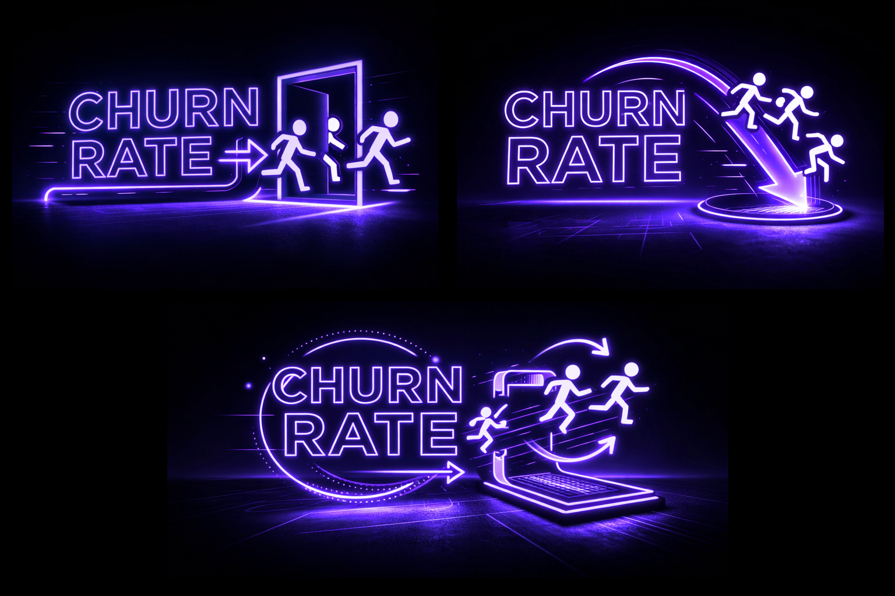

# Customer Churn Prediction for Proactive Customer Retention
### A Business-Aligned Machine Learning System for Identifying At-Risk Customers

  

## Project Highlights

- Developed a **machine learning churn prediction system** to identify high-risk telecom customers
- Benchmarked **4 algorithms (8 configurations)** under recall-focused evaluation
- Improved **recall from 0.54 → 0.87**, reducing missed churners by **71%**
- Estimated **~£381k potential recoverable revenue per 10,000 customers**
- Deployed an **interactive Streamlit application for churn risk scoring**

---

## Overview

Customer churn is one of the largest revenue risks for subscription-based businesses. This project develops a **machine learning churn prediction system** designed to identify customers at risk of leaving and enable **proactive retention strategies before revenue is lost**.

Using the **IBM Telco Customer Churn dataset (7,032 customers after cleaning; 26.6% churn rate)**, churn prediction is framed as a **business optimisation problem**, where the cost of **missing a churner (false negative)** is significantly higher than contacting a customer who may not churn.

Because of this asymmetric cost structure, model development prioritises **recall** rather than overall accuracy.

Four machine learning algorithms were benchmarked in both baseline and tuned configurations under a consistent evaluation framework. Following recall-focused hyperparameter tuning, **XGBoost delivered the strongest performance and was selected as the final model**.

## Code

---

## Live Application

The final model was deployed as an **interactive Streamlit application** allowing:

- Individual churn predictions
- Batch customer risk scoring
- Estimated revenue impact calculations

---

## Churn Prediction Pipeline

The project follows an end-to-end machine learning workflow from data preparation through model deployment.

  
   
  <em>End-to-end churn prediction pipeline used in this project</em>

---

## Key Results

The **final Tuned XGBoost model** significantly improved churn detection performance under recall-focused optimisation.

Compared with baseline models:

- **Recall increased from 0.54 → 0.87**
- **False negatives reduced from 171 → 49**
- **325 churners correctly detected in the test set**

By prioritising recall, the system identifies the majority of potential churners before cancellation.

---

## Business Impact

Model performance was translated into **estimated financial impact** using a scaled scenario of **10,000 customers**.

| Metric | Estimate |
|------|------|
| Additional churners identified | ~867 |
| Average future revenue per churner | ~£1,464 |
| Revenue exposure identified | ~£1.27M |
| Assuming 30% retention success | **~£381k recoverable revenue** |

These estimates represent **potential revenue exposure rather than guaranteed realised savings**, but illustrate how improved churn detection can materially affect retention outcomes.

---

## Why Recall Matters in Churn Prediction

In churn prediction, classification errors have **asymmetric business costs**.

- **False Negative (missed churner):** Customer leaves without intervention, resulting in lost recurring revenue.
- **False Positive (incorrect churn prediction):** A retention offer is made to a customer who may not churn.

In most subscription-based businesses, the cost of **losing a customer** far exceeds the cost of contacting one unnecessarily.

For this reason, the modelling strategy prioritises **recall**, ensuring the system captures as many potential churners as possible.

---

## Data Overview

### Dataset

**IBM Telco Customer Churn Dataset**

| Attribute | Details |
|----------|---------|
| Customers | 7,043 (7,032 after cleaning) |
| Features | 21 |
| Target | `Churn` |
| Churn Rate | 26.6% |
| Data Type | Mixed categorical and numerical |

### Key Predictive Features

Important customer attributes include:

- Customer tenure
- Contract type
- Internet service type
- Monthly charges
- Total charges
- Payment method
- Add-on services (TechSupport, OnlineSecurity, StreamingTV)

### Data Preparation

Key preprocessing steps included:

- Converting **TotalCharges** to numeric format
- Handling missing values
- Feature engineering (`AvgMonthlySpend`, tenure indicators)
- Encoding categorical variables
- Stratified train/test split

---

## Modeling Strategy

Multiple machine learning algorithms were benchmarked under a consistent evaluation framework.

### Models Evaluated

- Logistic Regression
- Decision Tree
- Random Forest
- XGBoost

Each model was trained in both **baseline and tuned configurations**.

### Hyperparameter Tuning

Models were tuned using cross-validation to optimise:

- model complexity
- tree depth
- learning rate
- sampling parameters
- class imbalance handling

Evaluation prioritised:

- **Recall**
- Precision
- F1-score

rather than raw accuracy.

---

## Model Performance

| Model | Accuracy | Precision | Recall | F1 |
|------|------|------|------|------|
| LR Baseline | 0.77 | 0.54 | 0.82 | 0.65 |
| LR Tuned | 0.77 | 0.55 | 0.82 | 0.66 |
| DT Baseline | 0.73 | 0.50 | 0.49 | 0.50 |
| DT Tuned | 0.75 | 0.52 | 0.80 | 0.63 |
| RF Baseline | 0.80 | 0.66 | 0.52 | 0.58 |
| RF Tuned | 0.78 | 0.57 | 0.78 | 0.66 |
| XGB Baseline | 0.81 | 0.68 | 0.54 | 0.60 |
| **XGB Tuned** | **0.73** | **0.49** | **0.87** | **0.63** |

**Primary evaluation metric: Recall**

---

## Final Model Selection

### Selected Model: Tuned XGBoost

Although Logistic Regression produced slightly better precision balance, **Tuned XGBoost was selected because it maximises recall**, aligning with the business objective of detecting as many churners as possible.

With **recall = 0.87**, the model identifies the majority of customers likely to churn.

---

## Model Explainability (SHAP)

To understand the drivers behind churn predictions, **SHAP (SHapley Additive exPlanations)** was used to measure feature contributions.

  

  <em>SHAP summary plot highlighting the most influential churn predictors</em>

### Key Drivers of Churn

SHAP analysis highlights several major churn predictors:

- Month-to-month contracts
- Fiber optic internet service
- Short customer tenure
- Higher monthly charges
- Electronic check payment method
- Lack of services such as **TechSupport** and **OnlineSecurity**

These insights help inform targeted retention strategies.

---

## Business Recommendations

Based on model insights, several retention strategies could reduce churn risk:

### 1. Encourage Long-Term Contracts

Customers on **month-to-month contracts exhibit significantly higher churn risk**. Offering discounted annual contracts could improve retention stability.

### 2. Improve Fiber Service Customer Experience

Fiber optic customers appear more likely to churn, suggesting possible **service quality or pricing concerns**.

### 3. Early Engagement for New Customers

Customers with **short tenure show elevated churn risk**. Targeted onboarding and early engagement programmes could reduce early cancellations.

### 4. Bundle Value-Added Services

Customers without **TechSupport or OnlineSecurity** services show increased churn risk. Bundling these services may increase perceived value and reduce churn.

---

## Limitations

Several limitations should be considered:

- Dataset size is relatively small (~7k customers)
- Behavioural usage data is not included
- Financial projections rely on simplified assumptions
- Default classification threshold (0.5) was used

In production systems, organisations would optimise thresholds based on **customer lifetime value and retention campaign cost**.

---

## Future Work

Potential improvements include:

- Cost-sensitive classification threshold optimisation
- Advanced imbalance techniques (SMOTE)
- Time-series behavioural modelling
- Customer-level explainability dashboards
- Production ML pipelines with monitoring and retraining

---

## Technology Stack

**Language**

- Python 3.12

**Libraries**

- Scikit-learn  
- XGBoost  
- Pandas  
- NumPy  
- SHAP  
- Matplotlib  
- Seaborn  
- Streamlit  

---

## Code

---

## Contact

&nbsp;&nbsp;

