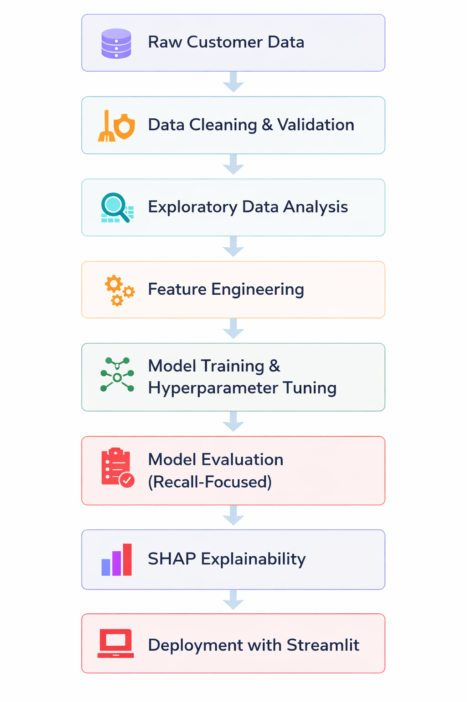
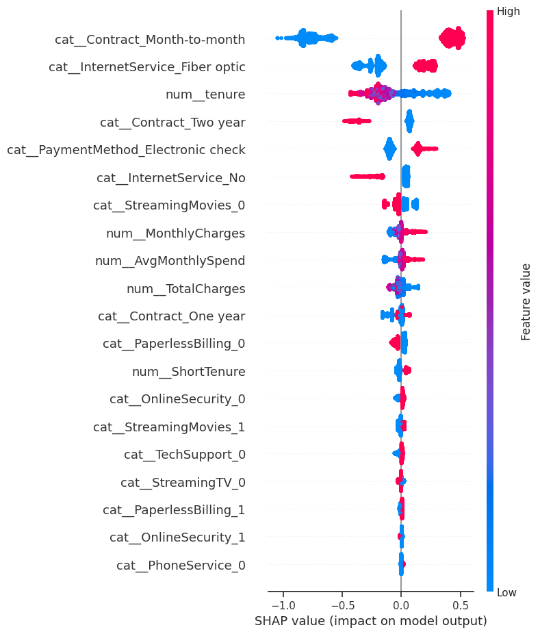

# Customer Churn Prediction Engine  
### A Business-Aligned Machine Learning System for Proactive Customer Retention

  

---

# Executive Summary

Customer churn represents one of the largest revenue risks for subscription-based businesses. This project builds a **machine learning churn prediction system** designed to identify high-risk customers and enable **proactive retention strategies** before revenue is lost.

Using the **IBM Telco Customer Churn dataset (7,032 customers after cleaning; 26.6% churn rate)**, churn prediction is reframed as a **business optimisation problem**, where the cost of **missing a churner (false negative)** is significantly higher than contacting a customer who would not churn.

Because of this asymmetric cost structure, model evaluation prioritises **recall** rather than overall accuracy.

Multiple machine learning models were benchmarked under a consistent evaluation framework. After recall-focused hyperparameter tuning, **Tuned XGBoost** was selected as the final model.

---

# Live Application

The final Tuned XGBoost model was deployed as an **interactive Streamlit application** that allows:

- Individual churn predictions
- Batch customer risk scoring
- Estimated revenue impact calculations

---

# Key Outcomes

- **Recall improved from 0.54 → 0.87**
- **False negatives reduced from 171 → 49**
- **325 churners correctly detected in the test set**
- **~£381k potential recoverable revenue per 10,000 customers**

The model prioritises identifying as many churn-risk customers as possible while maintaining competitive predictive performance.

---

# Business Value

This system enables organisations to move from **reactive churn management** to **proactive customer retention**.

With earlier churn detection, companies can:

- Identify high-risk customers before cancellation
- Target retention campaigns more efficiently
- Reduce recurring revenue loss
- Allocate retention budgets more effectively

The project demonstrates how **metric selection, model tuning, and evaluation strategy directly influence financial outcomes.**

---

# Problem Statement

Customer churn is a major challenge in subscription-based industries such as telecom, SaaS, and streaming services.

Acquiring new customers is significantly more expensive than retaining existing ones, making **early churn detection strategically important.**

### Objective

Develop a machine learning system that:

- **Maximises recall** to detect as many churners as possible
- Minimises **false negatives** (missed churners)
- Accepts controlled increases in false positives
- Generates actionable insights for retention strategies

---

# Data Overview

### Dataset

**IBM Telco Customer Churn Dataset**

| Attribute | Details |
|----------|---------|
| Customers | 7,043 (7,032 after cleaning) |
| Features | 21 |
| Target | `Churn` |
| Churn Rate | 26.6% |
| Data Type | Mixed numerical & categorical |

### Key Features

- Customer tenure
- Contract type
- Internet service type
- Monthly charges
- Total charges
- Payment method
- Add-on services (TechSupport, OnlineSecurity, StreamingTV, etc.)

### Data Preparation

Key preprocessing steps included:

- Converting **TotalCharges** to numeric format
- Handling missing values
- Feature engineering (`AvgMonthlySpend`, tenure indicators)
- Encoding categorical variables
- Train/test split using **stratified sampling**

---

# Machine Learning Workflow

The project follows a structured end-to-end machine learning workflow from data preparation through deployment.

  

  <em>End-to-end churn prediction pipeline used in this project</em>

---

# Modeling Strategy

Models were evaluated using a **20% hold-out test set**.

### Models Evaluated

- Logistic Regression (baseline & tuned)
- Decision Tree (baseline & tuned)
- Random Forest (baseline & tuned)
- XGBoost (baseline & tuned)

### Hyperparameter Tuning

Models were tuned using **cross-validation** and optimisation of:

- model complexity
- learning rate
- tree depth
- sampling parameters
- class imbalance handling

Evaluation focused on:

- **Recall**
- Precision
- F1-score

rather than raw accuracy.

---

# Model Performance

| Model | Accuracy | Precision | Recall | F1 |
|------|------|------|------|------|
| LR Baseline | 0.77 | 0.54 | 0.82 | 0.65 |
| LR Tuned | 0.77 | 0.55 | 0.82 | 0.66 |
| DT Baseline | 0.73 | 0.50 | 0.49 | 0.50 |
| DT Tuned | 0.75 | 0.52 | 0.80 | 0.63 |
| RF Baseline | 0.80 | 0.66 | 0.52 | 0.58 |
| RF Tuned | 0.78 | 0.57 | 0.78 | 0.66 |
| XGB Baseline | 0.81 | 0.68 | 0.54 | 0.60 |
| **XGB Tuned** | **0.73** | **0.49** | **0.87** | **0.63** |

**Primary evaluation metric: Recall**

---

# Final Model Selection

### Selected Model: Tuned XGBoost

Although Logistic Regression produced slightly higher precision-recall balance, **Tuned XGBoost was selected because it maximises recall**, aligning with the business objective of identifying as many churners as possible.

With **recall = 0.87**, the model detects the largest proportion of customers likely to churn.

---

# Confusion Matrix (Final Model)

| Actual \ Predicted | No Churn | Churn |
|-------------------|----------|-------|
| No Churn | 696 | 337 |
| Churn | 49 | 325 |

Interpretation:

- **325 churners correctly detected**
- Only **49 churners missed**
- False positives increased intentionally to reduce missed churners

In churn prediction, **missing a churner typically carries greater financial cost than contacting a customer who may not churn.**

---

# Model Explainability (SHAP)

To understand the drivers behind churn predictions, **SHAP (SHapley Additive exPlanations)** was used to measure the contribution of each feature to model output.

  

  <em>SHAP summary plot of key drivers influencing churn predictions</em>

### Key Drivers of Churn

SHAP analysis highlights several major churn predictors:

- **Month-to-month contracts**
- **Fiber optic internet service**
- **Short customer tenure**
- **Higher monthly charges**
- **Electronic check payment method**
- Lack of add-on services such as **TechSupport** and **OnlineSecurity**

These insights support targeted retention strategies.

---

# Financial Impact

To estimate business value, model performance was scaled to **10,000 customers**.

| Metric | Estimate |
|------|------|
| Additional churners identified | ~867 |
| Estimated future revenue per churner | ~£1,464 |
| Revenue exposure identified | ~£1.27M |
| Assuming 30% retention success | **~£381k recoverable revenue** |

These estimates represent **potential revenue exposure**, not guaranteed realised revenue.

---

# Limitations

Several limitations should be considered:

- Dataset size is relatively small (~7k customers)
- Behavioural usage data is not included
- Financial projections rely on simplified assumptions
- Default classification threshold (0.5) was used

In production environments, organisations would optimise thresholds based on **retention campaign cost and customer lifetime value.**

---

# Future Work

Potential extensions include:

- Cost-sensitive threshold optimisation
- Advanced imbalance techniques (SMOTE)
- Time-series behavioural modelling
- Customer-level explainability dashboards
- Production ML pipelines with monitoring and retraining

---

# Technology Stack

- Python  
- Scikit-learn  
- XGBoost  
- Pandas  
- NumPy  
- SHAP  
- Matplotlib  
- Seaborn  
- Streamlit

---

# Code

---

# Contact

 &nbsp;&nbsp;

