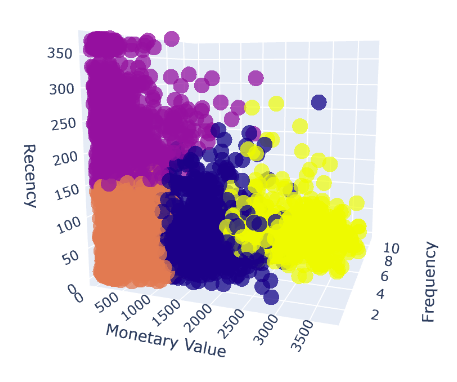

# Retail Intelligence: Sales Analytics & RFM-Based Customer Segmentation

<p align="center">
  
</p>

## Project Overview

This project combines **retail sales analytics** and **customer segmentation** to transform transactional data into actionable business insights.

Using Python, exploratory data analysis, and machine learning techniques, the project analyzes customer purchasing behavior, identifies revenue-driving segments, and develops business strategies to improve customer retention, engagement, and growth.

---

## Project Outcomes

- Analyzed retail transaction data to uncover customer and sales trends.
- Engineered **RFM (Recency, Frequency, Monetary)** features to profile customer behavior.
- Applied **K-Means Clustering** to identify actionable customer segments.
- Discovered high-value customer groups with strong spending and engagement characteristics.
- Developed segment-specific retention, reactivation, and growth strategies.
- Produced business-focused recommendations to support data-driven decision-making.

---

## Project Notebook

Explore the full analysis notebook:

[](https://github.com/MithileshGungah/Data-Science-Portfolio/blob/e800b16bf2392561a3812207169411d2640b0b66/Retail%20Intelligence%3A%20Sales%20Analytics%20%26%20RFM-Based%20Customer%20Segmentation/notebook/Online_Retail_Analysis_%26_Customer_Segmentation.ipynb))

---

## Business Problem

Retail businesses generate large volumes of transactional data, but converting that data into actionable customer insights remains a challenge.

This project addresses two key business questions:

1. What factors drive sales performance across customers, products, and regions?
2. How can customers be segmented based on purchasing behavior to support targeted marketing strategies?

---

## Project Workflow

```text
Raw Data
   ↓
Data Cleaning & Validation
   ↓
Exploratory Data Analysis
   ↓
RFM Feature Engineering
   ↓
Feature Scaling
   ↓
K-Means Clustering
   ↓
Customer Segmentation
   ↓
Business Recommendations
```

---

## Datasets

### Superstore Sales Dataset

Used for:

- Customer analysis
- Revenue analysis
- Product performance evaluation
- Geographic sales insights
- Shipping analysis
- Sales trend analysis

### Online Retail Dataset

Used for:

- Customer behavior analysis
- RFM modeling
- Customer segmentation
- Cluster profiling
- Marketing strategy development

---

## Technologies Used

- Python
- Pandas
- NumPy
- Matplotlib
- Seaborn
- Plotly
- Scikit-Learn

---

## Exploratory Data Analysis

### Sales Analysis

The sales analysis focused on:

- Customer segment performance
- Product and category profitability
- Regional sales distribution
- Shipping preferences
- Revenue trends over time

### Key Findings

- Consumer customers generated the highest overall revenue.
- California, New York, and Texas were among the strongest-performing markets.
- Phones and Chairs ranked among the top-performing product categories.
- Sales showed consistent growth over time.
- Standard Class was the most frequently selected shipping method.

---

## Customer Segmentation

### RFM Analysis

Customer behavior was summarized using three key metrics:

| Metric | Definition |
|----------|------------|
| Recency | Days since the customer's last purchase |
| Frequency | Number of purchases made |
| Monetary | Total customer spending |

These metrics were standardized and used as inputs for clustering.

---

## Clustering Methodology

### Feature Preparation

- Engineered RFM features from transaction-level data.
- Standardized features prior to clustering.
- Investigated outliers separately to improve segmentation quality.

### K-Means Clustering

K-Means clustering was applied to identify customer groups with similar purchasing behavior.

<p align="center">
  
</p>

Model selection was supported using:

- Elbow Method
- Silhouette Analysis

---

## Customer Segments

### Core Segments

| Segment | Characteristics | Recommended Action |
|----------|------------|------------|
| **Retain** | Established customers with consistent purchasing activity | Loyalty programs and retention campaigns |
| **Reward** | Engaged customers with moderate-to-high activity | Personalized offers and premium benefits |
| **Re-Engage** | Previously active customers showing reduced engagement | Win-back campaigns and targeted promotions |
| **Nurture** | Large customer base with lower spending and activity | Upselling, cross-selling, and engagement initiatives |

### Specialized Segments

| Segment | Characteristics | Recommended Action |
|----------|------------|------------|
| **Delight** | Highest-value customers with strong spending and purchase frequency | VIP treatment and premium experiences |
| **Pamper** | High-spending customers with less frequent purchases | Personalized retention strategies |
| **Upsell** | Customers with growth potential and above-average purchasing activity | Product recommendations and upsell campaigns |

---

## Key Segmentation Insights

- **NURTURE** and **RE-ENGAGE** are the largest customer segments but exhibit the lowest monetary value and purchase frequency.
- **DELIGHT** is the highest-value segment, demonstrating the strongest spending and customer engagement characteristics.
- **PAMPER** customers contribute significant value despite their relatively small segment size.
- **UPSELL** customers display promising growth potential through targeted product recommendations.
- **RETAIN** provides a stable customer foundation with opportunities for incremental revenue growth.

---

## Visualizations

The project includes:

- Customer and revenue analysis
- Product performance dashboards
- Geographic sales insights
- Sales trend analysis
- RFM distributions
- Elbow Method evaluation
- Silhouette Analysis
- Cluster distribution visualizations
- Interactive 3D customer segmentation plots

---

## Skills Demonstrated

### Data Analytics

- Data Cleaning
- Exploratory Data Analysis (EDA)
- Business Intelligence

### Data Science

- Feature Engineering
- RFM Modeling
- Customer Segmentation
- K-Means Clustering
- Cluster Evaluation

### Data Visualization

- Matplotlib
- Seaborn
- Plotly Interactive Visualizations

### Business Analytics

- Customer Retention Analysis
- Marketing Strategy Development
- Segmentation-Based Decision Making
- Data-Driven Business Strategy

---

## Repository Structure

```text
Retail-Intelligence-Customer-Segmentation/
│
├── data/
│   ├── superstore.csv
│   └── online_retail.csv (Too large to upload)
│
├── notebooks/
├── README.md
```

---

## Business Impact

This project demonstrates how transaction data can be leveraged to:

- Identify high-value customers
- Improve customer retention
- Develop targeted marketing campaigns
- Increase customer engagement
- Detect revenue growth opportunities
- Support data-driven business decisions

---

## Future Improvements

- Customer Lifetime Value (CLV) modeling
- Streamlit dashboard deployment
- Real-time customer analytics pipeline
