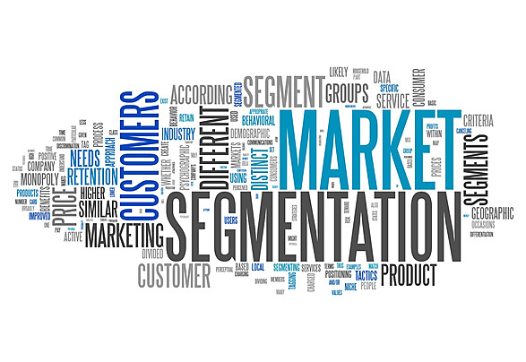

# Retail Intelligence: Sales Analytics & RFM-Based Customer Segmentation

## Overview

<p align="center">
  
</p>


This project combines retail sales analytics and customer segmentation to transform transactional data into actionable business insights.

The analysis is divided into two parts:

### Superstore Sales Analysis

- Customer and revenue analysis
- Product and category performance
- Geographic sales distribution
- Shipping preferences
- Sales trend analysis

### Online Retail Customer Segmentation

- Data cleaning and validation
- RFM (Recency, Frequency, Monetary) feature engineering
- Customer behavior analysis
- K-Means clustering
- Business-focused segmentation strategies

---

## Project Workflow

```text
Raw Data
   ↓
Data Cleaning & Validation
   ↓
Exploratory Data Analysis
   ↓
RFM Feature Engineering
   ↓
Scaling
   ↓
K-Means Clustering
   ↓
Customer Segmentation
   ↓
Business Recommendations
```

---

## Technologies Used

**Python • Pandas • NumPy • Matplotlib • Seaborn • Plotly • Scikit-Learn**

---

## Key Insights

### Sales Analysis

- Consumer customers generated the highest revenue.
- California, New York, and Texas were the strongest markets.
- Phones and Chairs were among the best-performing product categories.
- Sales demonstrated consistent year-over-year growth.
- Standard Class was the most preferred shipping method.

### Customer Segmentation

The retail dataset was cleaned and transformed into RFM metrics:

- **Recency** — Days since the customer's last purchase
- **Frequency** — Number of purchases
- **Monetary** — Total customer spending

After scaling and clustering, **4 customer segments** were identified using K-Means.

---

## Customer Segments

| Segment | Description | Business Action |
|----------|------------|----------------|
| **Retain** | High-value loyal customers | Loyalty programs and VIP rewards |
| **Reward** | Frequent and engaged customers | Personalized offers and premium benefits |
| **Re-engage** | Customers showing reduced activity | Win-back campaigns and promotions |
| **Nurture** | Lower-value customers with growth potential | Upselling and targeted marketing |

### Special Outlier Segments

| Segment | Description |
|----------|------------|
| **Pamper** | High spending, low purchase frequency |
| **Upsell** | High purchase frequency, moderate spending |
| **Delight** | High purchase frequency and high spending |

---

## Visualizations

The project includes:

- Customer and revenue analysis
- Geographic sales insights
- Product category performance
- Sales trend analysis
- RFM distributions
- Elbow and Silhouette analysis
- Interactive 3D customer cluster visualization

---

## Skills Demonstrated

- Exploratory Data Analysis (EDA)
- Data Cleaning and Validation
- Feature Engineering
- Data Visualization
- Customer Analytics
- RFM Modeling
- K-Means Clustering
- Business Intelligence

---

## Project Structure

```text
Retail-Intelligence-Customer-Segmentation/
│
├── data/
├── notebooks/
├── images/
├── README.md
└── requirements.txt
```

---

## Business Impact

This project demonstrates how retail transaction data can be leveraged to:

- Identify high-value customers
- Improve customer retention
- Personalize marketing campaigns
- Detect growth opportunities
- Support data-driven decision-making

---

## Author

Developed as an end-to-end retail analytics and customer segmentation project using Python, data visualization, and machine learning techniques.
