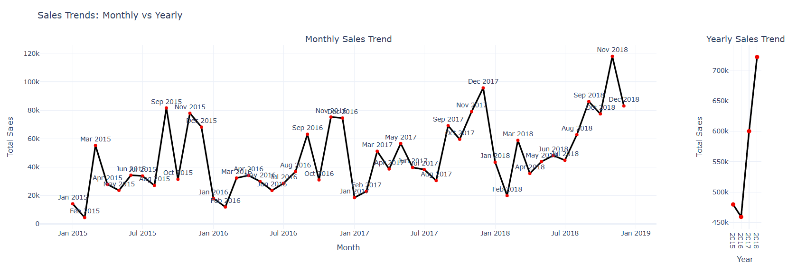
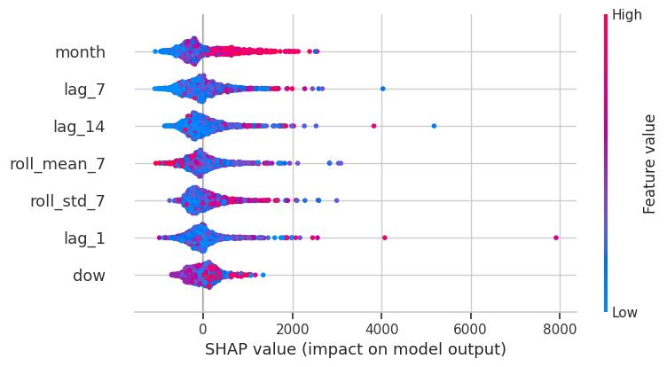
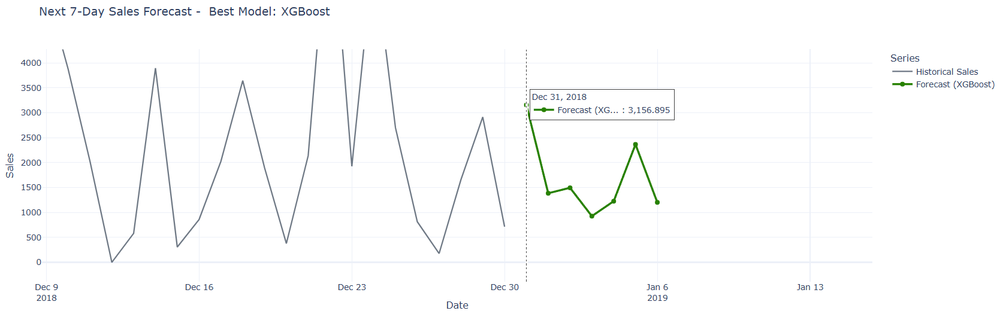

# Short-Term Sales Forecasting Under Volatile Demand

  

## Project Highlights

- Developed a **short-term retail demand forecasting framework** for a volatile daily sales time series
- Benchmarked **8 forecasting models** spanning statistical, machine learning, and deep learning approaches
- Implemented **rolling-origin backtesting with a 7-day recursive forecasting horizon**
- Achieved **24.9–30.9% RMSE reduction vs naive baselines**
- Applied **SHAP analysis to interpret seasonal demand drivers and lag effects**

---

## Overview

This project develops a **production-oriented short-term sales forecasting framework** for a highly volatile daily retail demand series.

Approximately **four years of historical transaction data** were aggregated into a continuous daily time series and used to benchmark **eight forecasting models** spanning **classical statistical methods, lagged-feature-based machine learning models, and deep learning approaches**:

- Naive baseline  
- Seasonal Naive  
- ARIMA  
- SARIMA  
- Prophet  
- Random Forest  
- XGBoost  
- LSTM  

All models were evaluated using **strict rolling-origin backtesting with a fixed 7-day forecast horizon**, replicating how forecasts behave under real operational deployment.

The **7-day forecasting horizon** aligns with common retail planning cycles such as **inventory replenishment, staffing allocation, and promotional planning**, while still providing sufficient planning visibility under volatile demand conditions.

Rather than maximising model complexity, the goal was to identify a model capable of producing **stable and well-calibrated forecasts under spike-driven demand dynamics**.

---

## Forecasting Pipeline

The project follows a structured forecasting workflow from exploratory analysis through model explainability and final demand prediction.

  
   
  <em>End-to-end modelling workflow used in this project</em>

---

## Key Results

**XGBoost delivered the strongest performance under rolling-origin evaluation**, outperforming both classical statistical models and deep learning approaches.

Compared with baseline methods, the final model achieved:

- **24.9% reduction in RMSE vs Naive baseline**
- **30.9% reduction in RMSE vs Seasonal Naive**
- **46.5% reduction in systematic under-forecast bias**

These improvements indicate that the model not only reduced overall forecast error but also **significantly improved demand calibration during volatile demand spikes**, where large forecast misses can create disproportionate operational costs.

---

## Seasonal Demand Signal

Exploratory analysis revealed **strong recurring monthly demand patterns**, with consistent peaks during specific months and a clear surge toward year-end.

  

These seasonal patterns directly informed feature engineering. Calendar variables such as **month** and **day-of-week**, together with **lagged demand signals** and **rolling demand statistics**, were incorporated into the modelling pipeline.

Model explainability using **SHAP** confirmed that the model learned the same seasonal structure identified during exploratory analysis.

  

SHAP analysis shows that **month is the most influential feature**, followed by short-term demand signals such as **lag_7** and **lag_14**. This indicates that the model leverages both **calendar-driven seasonality and recent demand momentum** when generating forecasts.

---

## Forecast Behaviour (7-Day Recursive Prediction)

The figure below illustrates a **7-day recursive forecast generated by the final XGBoost model**.

  

The forecast follows patterns consistent with historical demand behaviour.

Key observations:

- **Dec 31 shows elevated predicted sales**, consistent with typical **year-end demand spikes**.
- **Jan 1 shows a sharp decline**, reflecting the common **post-holiday demand drop**.
- Subsequent days stabilise as the model adjusts based on **recent lag signals and seasonal structure**.

This behaviour demonstrates that the model captures both **calendar-driven demand effects and short-term demand momentum**, producing forecasts that align with observed retail demand dynamics.

---

## Why Forecasting This Series Is Challenging

Daily retail demand in this dataset exhibits several characteristics that make forecasting difficult:

- Strong **weekly and monthly seasonality**
- **Heavy-tailed demand spikes**
- **Nonlinear demand dynamics**
- Irregular **high-impact transactions**

In such environments, forecasting models must be able to **adapt to nonlinear behaviour and extreme deviations**, rather than simply minimising average error.

Improving forecast calibration during volatile periods is often **more operationally valuable than marginal improvements in average accuracy**.

---

## Methodology Highlights

To ensure realistic evaluation and production relevance, the modelling framework includes:

- Construction of a **continuous daily time series with strict temporal integrity**
- **Leakage-free feature engineering** using lagged demand and rolling statistics
- **Rolling-origin cross-validation** with recursive 7-day forecasting
- Unified evaluation across all candidate models
- Metrics aligned with operational risk: **MAE, RMSE, and WMAPE**
- Explicit comparison of **interpretability vs predictive performance**

This evaluation framework closely simulates how forecasting models behave when deployed in real retail planning environments.

---

## Models Benchmarked

Eight forecasting models were evaluated to compare different modelling paradigms.

| Model Type | Model | Key Strength |
|------|------|------|
| Baseline | Naive | Simple persistence benchmark |
| Baseline | Seasonal Naive | Captures weekly seasonality |
| Statistical | ARIMA | Classical autoregressive modelling |
| Statistical | SARIMA | Seasonal time-series modelling |
| Hybrid | Prophet | Additive trend + seasonality modelling |
| Machine Learning | Random Forest | Nonlinear feature interactions |
| Machine Learning | **XGBoost** | Boosted tree ensembles |
| Deep Learning | LSTM | Sequential neural modelling |

Classical seasonal models performed well but were less adaptive to irregular demand spikes, while deep sequence models did not outperform tree-based boosting under recursive multi-step forecasting and moderate data volume.

---

## Interpretability and Governance

To ensure transparency in model selection and feature influence:

- **SHAP** was applied to the final XGBoost model  
- **Month-level seasonality** and **weekly lag features** emerged as dominant drivers  
- Rolling demand statistics stabilised predictions during volatile periods  

This confirms that predictive improvements are driven by **meaningful temporal structure rather than noise or overfitting**.

---

## Business Impact

A **24.9–30.9% reduction in RMSE** combined with a **46.5% reduction in systematic under-forecast bias** translates into tangible operational improvements in retail demand planning.

Potential benefits include:

- Reduced **stockout risk during demand surges**
- Lower **overstock exposure during demand pullbacks**
- Improved **short-term inventory alignment**
- More reliable **weekly replenishment and staffing decisions**

Forecast accuracy improvements are particularly valuable during **high-volatility periods**, where large forecast misses can create disproportionate operational costs.

---

## Core Takeaways

- Forecasting performance depends on **alignment with demand structure**, not model complexity alone  
- **Boosted tree ensembles can outperform deep learning** in moderate-sized retail time-series datasets  
- **Rolling-origin validation is essential** for realistic deployment simulation  
- Explainability tools such as **SHAP allow high-capacity models to remain transparent and auditable**

---

## Technology Stack

**Language**

- Python 3.12

**Libraries**

- Pandas  
- NumPy  
- Scikit-learn  
- Statsmodels  
- Prophet  
- XGBoost  
- TensorFlow  
- SHAP  
- Matplotlib  
- Seaborn  

---

## Code

---

## Contact

&nbsp;&nbsp;

